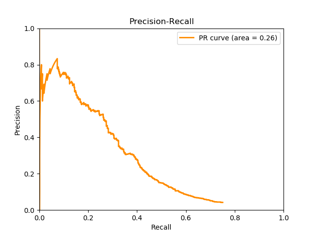

# Evaluation

The input file contains the predictions for quadruple instances. It takes the maximum prediction of these instances for each quadruple to evaluate the quaduple at the 'document level'. Then calculates precision, recall, and threshold to get AUC and F1. Prints the number of 'document level' positive and negative examples. It outputs the metrics at precision = 0.5 and threshold = 0.5. All these metrics are printed to stdout. There's also an option to plot the precision-recall graph, output the precision, recall, threshold to a file, and output the selected quadruples along with their labels and max prediction scores.

I use variants of the form q456\* , where '\*' is any amino acid. If the prediction file contain variants that have 'x' for the last char, this script will convert it to '\*'.

For drugs, the script will convert synonym forms of the drug to the canonical form for comparison with the known quadruples list. The synonyms are in the DRUG_FILES specified in util.

### Run Script

To run, go to root directory and run the eval script:

```
python machinereading/evaluation/eval.py <input_prediction_file_path>  --pr_image_file <output_pr_image_path> --pr_data_file <output_pr_data_file> --quads_file <quadruples_file>
```

Input prediction file should be a tab-separated file with the following columns:

sample_idx, pmid, drug, gene, variant, prediction 

For example:<br />
0       27432227        crizotinib      alk     f1174c  0.45130777<br />
1       27432227        crizotinib      alk     f1174c  0.72222424<br />
2       27432227        crizotinib      alk     f1174c  0.08492919<br />
3       27432227        crizotinib      alk     f1174c  0.90769345<br />
4       26372962        brigatinib      ros1    f2075v  0.017790493<br />
5       26372962        brigatinib      ros1    f2075v  0.006136571<br />

--recall_correct (default=True): because the predictions may not return all the quadruples that are present in JAX, we compare against the known quadruples list and decrease the recall by the percentage of correctly found quadruples. Set this to false if you want to assume the quadruples in the prediction file contains all the positive quadruples.

--skip_known_triples (default=True): a True value for this flag skips inputs that are not in the known JAX quadruples list but are in the JAX triples list. This is because some PMIDs do not list all the triples that are in the text so some candidates that are not in the quadruples list may be incorrectly labeled as negatives.

--pr_image_file (optional): outputs a .png file of the Precision-Recall curve at this location

--pr_data_file (optional): outputs a tab-separated file of the precision, recall, and threshold at this location

--quads_file (optional): outputs a tab-separated file of the quadruple instances that had the highest prediction score out of all instances for that quadruple. It also shows the 'truth label' according to the jax dataset and corresponding maximum prediction score for that quadruple.

--thresh (optional): prints the precision, recall, and F1 at this threshold 

### Output

Example output to stdout:

============================================================<br />
AUC: 0.2636<br />
Positive Examples: 359<br />
Negative Examples: 8954<br />
Positives Found: 75.1%

Metrics at 0.5 precision<br />
Precision: 0.5000<br />
Recall: 0.2636<br />
Threshold: 0.9195<br />
F1: 0.3452

Metrics at 0.5 threshold<br />
Precision: 0.0940<br />
Recall: 0.5858<br />
Threshold: 0.5002<br />
F1: 0.1620

PR AUC: 0.4744<br />
AvgPrec: 0.4746<br />
Positive Examples: 985<br />
Negative Examples: 6266<br />
Positives Found(Max Recall): 74.4%<br />

Metrics at 0.5 precision<br />
Precision: 0.5000<br />
Recall: 0.5461<br />
Threshold: 0.9715<br />
F1: 0.5220

Metrics at 0.500000 threshold<br />
Precision: 0.4010<br />
Recall: 0.5891<br />
Threshold: 0.5010<br />
F1: 0.4772

Metrics at best threshold<br />
Precision: 0.5267<br />
Recall: 0.5295<br />
Threshold: 1.1388<br />
F1: 0.5281

Metrics at 1.136012 threshold<br />
Precision: 0.5255<br />
Recall: 0.5295<br />
Threshold: 1.1363<br />
F1: 0.5275

============================================================<br />

Example Precision-Recall graph:



Note: the missing part of the graph above .75 recall is due to the input prediction file not containing 25% of the known quadruples in the QUAD_FILES. You can turn this off by setting the --recall_correct to False so recall would only use the positive examples in the prediction file.
